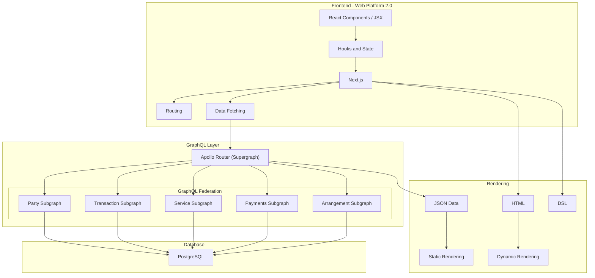

# E-Commerce Platform Architecture Plan

## Overview

This document outlines the architecture for an e-commerce platform built with Next.js, React, GraphQL, and PostgreSQL. The architecture follows a modern web application approach with GraphQL Federation and leverages both static and dynamic rendering capabilities of Next.js.

## System Architecture



## Component Breakdown

### Frontend Layer
- **React Components**: UI building blocks using JSX
- **Hooks and State**: State management using React hooks
- **Next.js**: Framework for server-side rendering and static site generation
- **Routing**: App Router for handling navigation
- **Data Fetching**: Fetching data from GraphQL API

### GraphQL Layer
- **Apollo Router**: Gateway for GraphQL federation
- **GraphQL Federation**: Composed of multiple subgraphs:
  - **Party Subgraph**: User accounts, profiles, roles, permissions
  - **Transaction Subgraph**: Orders, order history, cart management
  - **Service Subgraph**: Product catalog, categories, search
  - **Payments Subgraph**: Payment methods, processing, invoicing
  - **Arrangement Subgraph**: Promotions, discounts, special offers

### Database Layer
- **PostgreSQL**: Relational database for storing all application data

### Rendering Strategies
- **Static Rendering**: Pre-rendered content for product pages, categories
- **Dynamic Rendering**: Real-time content for user-specific data, cart
- **JSON Data**: Data exchange format between frontend and backend
- **HTML**: Markup language for web pages
- **DSL**: Domain-specific language for specialized functionality

## Database Schema

### Users Table
```
users (
  id UUID PRIMARY KEY,
  email VARCHAR(255) UNIQUE NOT NULL,
  password_hash VARCHAR(255) NOT NULL,
  first_name VARCHAR(100),
  last_name VARCHAR(100),
  created_at TIMESTAMP DEFAULT NOW(),
  updated_at TIMESTAMP DEFAULT NOW()
)
```

### Products Table
```
products (
  id UUID PRIMARY KEY,
  name VARCHAR(255) NOT NULL,
  description TEXT,
  price DECIMAL(10,2) NOT NULL,
  stock_quantity INTEGER NOT NULL,
  category_id UUID REFERENCES categories(id),
  created_at TIMESTAMP DEFAULT NOW(),
  updated_at TIMESTAMP DEFAULT NOW()
)
```

### Categories Table
```
categories (
  id UUID PRIMARY KEY,
  name VARCHAR(100) NOT NULL,
  description TEXT,
  parent_id UUID REFERENCES categories(id),
  created_at TIMESTAMP DEFAULT NOW(),
  updated_at TIMESTAMP DEFAULT NOW()
)
```

### Orders Table
```
orders (
  id UUID PRIMARY KEY,
  user_id UUID REFERENCES users(id),
  status VARCHAR(50) NOT NULL,
  total_amount DECIMAL(10,2) NOT NULL,
  created_at TIMESTAMP DEFAULT NOW(),
  updated_at TIMESTAMP DEFAULT NOW()
)
```

### Order Items Table
```
order_items (
  id UUID PRIMARY KEY,
  order_id UUID REFERENCES orders(id),
  product_id UUID REFERENCES products(id),
  quantity INTEGER NOT NULL,
  unit_price DECIMAL(10,2) NOT NULL,
  created_at TIMESTAMP DEFAULT NOW(),
  updated_at TIMESTAMP DEFAULT NOW()
)
```

### Payments Table
```
payments (
  id UUID PRIMARY KEY,
  order_id UUID REFERENCES orders(id),
  amount DECIMAL(10,2) NOT NULL,
  payment_method VARCHAR(50) NOT NULL,
  status VARCHAR(50) NOT NULL,
  transaction_id VARCHAR(255),
  created_at TIMESTAMP DEFAULT NOW(),
  updated_at TIMESTAMP DEFAULT NOW()
)
```

### Promotions Table
```
promotions (
  id UUID PRIMARY KEY,
  name VARCHAR(255) NOT NULL,
  description TEXT,
  discount_type VARCHAR(50) NOT NULL,
  discount_value DECIMAL(10,2) NOT NULL,
  start_date TIMESTAMP NOT NULL,
  end_date TIMESTAMP NOT NULL,
  created_at TIMESTAMP DEFAULT NOW(),
  updated_at TIMESTAMP DEFAULT NOW()
)
```

## GraphQL Schema Design

### Party Subgraph
```graphql
type User {
  id: ID!
  email: String!
  firstName: String
  lastName: String
  createdAt: String!
  updatedAt: String!
}

type Query {
  user(id: ID!): User
  users: [User!]!
}

type Mutation {
  createUser(email: String!, password: String!, firstName: String, lastName: String): User!
  updateUser(id: ID!, email: String, firstName: String, lastName: String): User!
  deleteUser(id: ID!): Boolean!
}
```

### Service Subgraph
```graphql
type Product {
  id: ID!
  name: String!
  description: String
  price: Float!
  stockQuantity: Int!
  category: Category
  createdAt: String!
  updatedAt: String!
}

type Category {
  id: ID!
  name: String!
  description: String
  parentCategory: Category
  products: [Product!]!
  createdAt: String!
  updatedAt: String!
}

type Query {
  product(id: ID!): Product
  products(categoryId: ID, search: String): [Product!]!
  category(id: ID!): Category
  categories: [Category!]!
}

type Mutation {
  createProduct(name: String!, description: String, price: Float!, stockQuantity: Int!, categoryId: ID): Product!
  updateProduct(id: ID!, name: String, description: String, price: Float, stockQuantity: Int, categoryId: ID): Product!
  deleteProduct(id: ID!): Boolean!
}
```

### Transaction Subgraph
```graphql
type Order {
  id: ID!
  user: User!
  status: String!
  totalAmount: Float!
  items: [OrderItem!]!
  payment: Payment
  createdAt: String!
  updatedAt: String!
}

type OrderItem {
  id: ID!
  product: Product!
  quantity: Int!
  unitPrice: Float!
}

type Query {
  order(id: ID!): Order
  orders(userId: ID): [Order!]!
}

type Mutation {
  createOrder(userId: ID!, items: [OrderItemInput!]!): Order!
  updateOrderStatus(id: ID!, status: String!): Order!
}

input OrderItemInput {
  productId: ID!
  quantity: Int!
}
```

### Payments Subgraph
```graphql
type Payment {
  id: ID!
  order: Order!
  amount: Float!
  paymentMethod: String!
  status: String!
  transactionId: String
  createdAt: String!
  updatedAt: String!
}

type Query {
  payment(id: ID!): Payment
  paymentsByOrder(orderId: ID!): [Payment!]!
}

type Mutation {
  createPayment(orderId: ID!, amount: Float!, paymentMethod: String!): Payment!
  updatePaymentStatus(id: ID!, status: String!, transactionId: String): Payment!
}
```

### Arrangement Subgraph
```graphql
type Promotion {
  id: ID!
  name: String!
  description: String
  discountType: String!
  discountValue: Float!
  startDate: String!
  endDate: String!
  createdAt: String!
  updatedAt: String!
}

type Query {
  promotion(id: ID!): Promotion
  activePromotions: [Promotion!]!
}

type Mutation {
  createPromotion(name: String!, description: String, discountType: String!, discountValue: Float!, startDate: String!, endDate: String!): Promotion!
  updatePromotion(id: ID!, name: String, description: String, discountType: String, discountValue: Float, startDate: String, endDate: String): Promotion!
  deletePromotion(id: ID!): Boolean!
}
```

## Next.js App Structure

```
/
├── app/
│   ├── api/
│   │   └── graphql/
│   │       └── route.ts
│   ├── products/
│   │   ├── [id]/
│   │   │   └── page.tsx
│   │   └── page.tsx
│   ├── categories/
│   │   ├── [id]/
│   │   │   └── page.tsx
│   │   └── page.tsx
│   ├── cart/
│   │   └── page.tsx
│   ├── checkout/
│   │   └── page.tsx
│   ├── account/
│   │   └── page.tsx
│   ├── layout.tsx
│   └── page.tsx
├── components/
│   ├── ui/
│   ├── product/
│   ├── cart/
│   └── checkout/
├── lib/
│   ├── apollo/
│   ├── db/
│   └── utils/
├── graphql/
│   ├── schema/
│   ├── resolvers/
│   └── federation/
└── public/
```

## Implementation Approach

1. **Setup Phase**:
   - Initialize Next.js project with TypeScript
   - Set up PostgreSQL database
   - Configure GraphQL server with Apollo

2. **Backend Development**:
   - Implement database schema
   - Create GraphQL subgraphs
   - Set up Apollo Router for federation
   - Implement resolvers and data models

3. **Frontend Development**:
   - Create React components
   - Implement routing with Next.js App Router
   - Set up state management with React hooks
   - Implement data fetching from GraphQL API

4. **Feature Implementation**:
   - User authentication and account management
   - Product catalog and search
   - Shopping cart functionality
   - Checkout and payment processing
   - Order management

5. **Optimization and Deployment**:
   - Implement static and dynamic rendering strategies
   - Optimize performance
   - Set up CI/CD pipeline
   - Deploy to production

## Technology Stack

- **Frontend**:
  - Next.js 14+ (App Router)
  - React 18+
  - TypeScript
  - Apollo Client

- **Backend**:
  - Node.js
  - Apollo Server
  - GraphQL
  - Apollo Federation

- **Database**:
  - PostgreSQL

- **DevOps**:
  - Docker
  - GitHub Actions (CI/CD)

## Conclusion

This architecture provides a solid foundation for building a scalable and maintainable e-commerce platform. The use of GraphQL Federation allows for modular development and scaling of different parts of the application independently. Next.js with the App Router provides powerful rendering strategies for optimal performance and user experience.