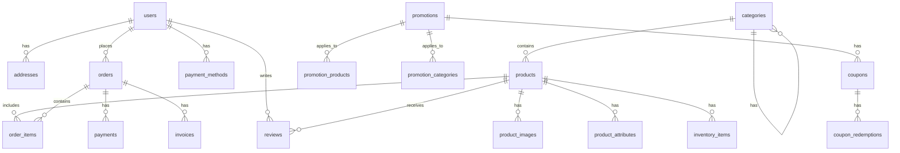

# PostgreSQL Database Schema Specification

## Overview

This document outlines the database schema for our e-commerce platform. The schema is designed to support the GraphQL federation architecture with separate subgraphs for different domains.

## Database Design Principles

1. **Normalization**: Tables are normalized to reduce redundancy and improve data integrity
2. **Referential Integrity**: Foreign key constraints ensure data consistency
3. **Indexing**: Strategic indexes for performance optimization
4. **UUID Primary Keys**: Using UUIDs for primary keys to allow distributed ID generation
5. **Timestamps**: Created and updated timestamps for all tables
6. **Soft Deletes**: Using deleted_at timestamp for soft deletes where appropriate
7. **Enums**: Using PostgreSQL enums for fixed sets of values
8. **JSON/JSONB**: Using JSONB for flexible attributes and metadata

## Schema Diagram



## Table Definitions

### Party Domain

#### users

```sql
CREATE TABLE users (
    id UUID PRIMARY KEY DEFAULT gen_random_uuid(),
    email VARCHAR(255) NOT NULL UNIQUE,
    password_hash VARCHAR(255) NOT NULL,
    first_name VARCHAR(100),
    last_name VARCHAR(100),
    phone VARCHAR(50),
    is_active BOOLEAN NOT NULL DEFAULT true,
    email_verified BOOLEAN NOT NULL DEFAULT false,
    last_login_at TIMESTAMP WITH TIME ZONE,
    created_at TIMESTAMP WITH TIME ZONE NOT NULL DEFAULT NOW(),
    updated_at TIMESTAMP WITH TIME ZONE NOT NULL DEFAULT NOW(),
    deleted_at TIMESTAMP WITH TIME ZONE
);

CREATE INDEX idx_users_email ON users(email);
CREATE INDEX idx_users_is_active ON users(is_active) WHERE is_active = true;
```

#### addresses

```sql
CREATE TYPE address_type AS ENUM ('BILLING', 'SHIPPING');

CREATE TABLE addresses (
    id UUID PRIMARY KEY DEFAULT gen_random_uuid(),
    user_id UUID NOT NULL REFERENCES users(id) ON DELETE CASCADE,
    type address_type NOT NULL,
    street VARCHAR(255) NOT NULL,
    city VARCHAR(100) NOT NULL,
    state VARCHAR(100) NOT NULL,
    postal_code VARCHAR(20) NOT NULL,
    country VARCHAR(100) NOT NULL,
    is_default BOOLEAN NOT NULL DEFAULT false,
    created_at TIMESTAMP WITH TIME ZONE NOT NULL DEFAULT NOW(),
    updated_at TIMESTAMP WITH TIME ZONE NOT NULL DEFAULT NOW()
);

CREATE INDEX idx_addresses_user_id ON addresses(user_id);
CREATE INDEX idx_addresses_user_type ON addresses(user_id, type);
```

#### roles

```sql
CREATE TABLE roles (
    id UUID PRIMARY KEY DEFAULT gen_random_uuid(),
    name VARCHAR(50) NOT NULL UNIQUE,
    description TEXT,
    created_at TIMESTAMP WITH TIME ZONE NOT NULL DEFAULT NOW(),
    updated_at TIMESTAMP WITH TIME ZONE NOT NULL DEFAULT NOW()
);
```

#### permissions

```sql
CREATE TABLE permissions (
    id UUID PRIMARY KEY DEFAULT gen_random_uuid(),
    name VARCHAR(100) NOT NULL UNIQUE,
    description TEXT,
    created_at TIMESTAMP WITH TIME ZONE NOT NULL DEFAULT NOW(),
    updated_at TIMESTAMP WITH TIME ZONE NOT NULL DEFAULT NOW()
);
```

#### role_permissions

```sql
CREATE TABLE role_permissions (
    role_id UUID NOT NULL REFERENCES roles(id) ON DELETE CASCADE,
    permission_id UUID NOT NULL REFERENCES permissions(id) ON DELETE CASCADE,
    created_at TIMESTAMP WITH TIME ZONE NOT NULL DEFAULT NOW(),
    PRIMARY KEY (role_id, permission_id)
);
```

#### user_roles

```sql
CREATE TABLE user_roles (
    user_id UUID NOT NULL REFERENCES users(id) ON DELETE CASCADE,
    role_id UUID NOT NULL REFERENCES roles(id) ON DELETE CASCADE,
    created_at TIMESTAMP WITH TIME ZONE NOT NULL DEFAULT NOW(),
    PRIMARY KEY (user_id, role_id)
);
```

### Service Domain

#### categories

```sql
CREATE TABLE categories (
    id UUID PRIMARY KEY DEFAULT gen_random_uuid(),
    name VARCHAR(100) NOT NULL,
    description TEXT,
    slug VARCHAR(100) NOT NULL UNIQUE,
    parent_id UUID REFERENCES categories(id),
    is_active BOOLEAN NOT NULL DEFAULT true,
    sort_order INTEGER NOT NULL DEFAULT 0,
    created_at TIMESTAMP WITH TIME ZONE NOT NULL DEFAULT NOW(),
    updated_at TIMESTAMP WITH TIME ZONE NOT NULL DEFAULT NOW(),
    deleted_at TIMESTAMP WITH TIME ZONE
);

CREATE INDEX idx_categories_parent_id ON categories(parent_id);
CREATE INDEX idx_categories_slug ON categories(slug);
```

#### products

```sql
CREATE TABLE products (
    id UUID PRIMARY KEY DEFAULT gen_random_uuid(),
    name VARCHAR(255) NOT NULL,
    description TEXT,
    slug VARCHAR(255) NOT NULL UNIQUE,
    sku VARCHAR(100) UNIQUE,
    price DECIMAL(10, 2) NOT NULL,
    currency VARCHAR(3) NOT NULL DEFAULT 'USD',
    category_id UUID REFERENCES categories(id),
    is_active BOOLEAN NOT NULL DEFAULT true,
    is_featured BOOLEAN NOT NULL DEFAULT false,
    metadata JSONB,
    created_at TIMESTAMP WITH TIME ZONE NOT NULL DEFAULT NOW(),
    updated_at TIMESTAMP WITH TIME ZONE NOT NULL DEFAULT NOW(),
    deleted_at TIMESTAMP WITH TIME ZONE
);

CREATE INDEX idx_products_category_id ON products(category_id);
CREATE INDEX idx_products_slug ON products(slug);
CREATE INDEX idx_products_is_active ON products(is_active) WHERE is_active = true;
CREATE INDEX idx_products_is_featured ON products(is_featured) WHERE is_featured = true;
CREATE INDEX idx_products_price ON products(price);
```

#### product_images

```sql
CREATE TABLE product_images (
    id UUID PRIMARY KEY DEFAULT gen_random_uuid(),
    product_id UUID NOT NULL REFERENCES products(id) ON DELETE CASCADE,
    url VARCHAR(255) NOT NULL,
    alt_text VARCHAR(255),
    is_primary BOOLEAN NOT NULL DEFAULT false,
    sort_order INTEGER NOT NULL DEFAULT 0,
    created_at TIMESTAMP WITH TIME ZONE NOT NULL DEFAULT NOW(),
    updated_at TIMESTAMP WITH TIME ZONE NOT NULL DEFAULT NOW()
);

CREATE INDEX idx_product_images_product_id ON product_images(product_id);
```

#### product_attributes

```sql
CREATE TABLE product_attributes (
    id UUID PRIMARY KEY DEFAULT gen_random_uuid(),
    product_id UUID NOT NULL REFERENCES products(id) ON DELETE CASCADE,
    name VARCHAR(100) NOT NULL,
    value TEXT NOT NULL,
    created_at TIMESTAMP WITH TIME ZONE NOT NULL DEFAULT NOW(),
    updated_at TIMESTAMP WITH TIME ZONE NOT NULL DEFAULT NOW()
);

CREATE INDEX idx_product_attributes_product_id ON product_attributes(product_id);
CREATE INDEX idx_product_attributes_name ON product_attributes(name);
```

#### inventory_items

```sql
CREATE TABLE inventory_items (
    id UUID PRIMARY KEY DEFAULT gen_random_uuid(),
    product_id UUID NOT NULL REFERENCES products(id) ON DELETE CASCADE,
    quantity INTEGER NOT NULL DEFAULT 0,
    reserved_quantity INTEGER NOT NULL DEFAULT 0,
    restock_threshold INTEGER,
    restock_date TIMESTAMP WITH TIME ZONE,
    created_at TIMESTAMP WITH TIME ZONE NOT NULL DEFAULT NOW(),
    updated_at TIMESTAMP WITH TIME ZONE NOT NULL DEFAULT NOW()
);

CREATE UNIQUE INDEX idx_inventory_items_product_id ON inventory_items(product_id);
CREATE INDEX idx_inventory_items_quantity ON inventory_items(quantity);
```

#### reviews

```sql
CREATE TABLE reviews (
    id UUID PRIMARY KEY DEFAULT gen_random_uuid(),
    product_id UUID NOT NULL REFERENCES products(id) ON DELETE CASCADE,
    user_id UUID NOT NULL REFERENCES users(id) ON DELETE CASCADE,
    rating INTEGER NOT NULL CHECK (rating BETWEEN 1 AND 5),
    comment TEXT,
    is_approved BOOLEAN NOT NULL DEFAULT false,
    created_at TIMESTAMP WITH TIME ZONE NOT NULL DEFAULT NOW(),
    updated_at TIMESTAMP WITH TIME ZONE NOT NULL DEFAULT NOW()
);

CREATE INDEX idx_reviews_product_id ON reviews(product_id);
CREATE INDEX idx_reviews_user_id ON reviews(user_id);
CREATE INDEX idx_reviews_rating ON reviews(rating);
CREATE UNIQUE INDEX idx_reviews_product_user ON reviews(product_id, user_id);
```

### Transaction Domain

#### carts

```sql
CREATE TABLE carts (
    id UUID PRIMARY KEY DEFAULT gen_random_uuid(),
    user_id UUID REFERENCES users(id) ON DELETE SET NULL,
    session_id VARCHAR(100),
    created_at TIMESTAMP WITH TIME ZONE NOT NULL DEFAULT NOW(),
    updated_at TIMESTAMP WITH TIME ZONE NOT NULL DEFAULT NOW(),
    expires_at TIMESTAMP WITH TIME ZONE,
    CONSTRAINT check_cart_owner CHECK (user_id IS NOT NULL OR session_id IS NOT NULL)
);

CREATE INDEX idx_carts_user_id ON carts(user_id);
CREATE INDEX idx_carts_session_id ON carts(session_id);
```

#### cart_items

```sql
CREATE TABLE cart_items (
    id UUID PRIMARY KEY DEFAULT gen_random_uuid(),
    cart_id UUID NOT NULL REFERENCES carts(id) ON DELETE CASCADE,
    product_id UUID NOT NULL REFERENCES products(id) ON DELETE CASCADE,
    quantity INTEGER NOT NULL CHECK (quantity > 0),
    unit_price DECIMAL(10, 2) NOT NULL,
    currency VARCHAR(3) NOT NULL DEFAULT 'USD',
    created_at TIMESTAMP WITH TIME ZONE NOT NULL DEFAULT NOW(),
    updated_at TIMESTAMP WITH TIME ZONE NOT NULL DEFAULT NOW()
);

CREATE INDEX idx_cart_items_cart_id ON cart_items(cart_id);
CREATE UNIQUE INDEX idx_cart_items_cart_product ON cart_items(cart_id, product_id);
```

#### orders

```sql
CREATE TYPE order_status AS ENUM (
    'PENDING',
    'PROCESSING',
    'SHIPPED',
    'DELIVERED',
    'CANCELLED',
    'REFUNDED'
);

CREATE TABLE orders (
    id UUID PRIMARY KEY DEFAULT gen_random_uuid(),
    order_number VARCHAR(50) NOT NULL UNIQUE,
    user_id UUID REFERENCES users(id) ON DELETE SET NULL,
    status order_status NOT NULL DEFAULT 'PENDING',
    subtotal DECIMAL(10, 2) NOT NULL,
    tax DECIMAL(10, 2) NOT NULL,
    shipping DECIMAL(10, 2) NOT NULL,
    total DECIMAL(10, 2) NOT NULL,
    currency VARCHAR(3) NOT NULL DEFAULT 'USD',
    shipping_address_street VARCHAR(255) NOT NULL,
    shipping_address_city VARCHAR(100) NOT NULL,
    shipping_address_state VARCHAR(100) NOT NULL,
    shipping_address_postal_code VARCHAR(20) NOT NULL,
    shipping_address_country VARCHAR(100) NOT NULL,
    billing_address_street VARCHAR(255) NOT NULL,
    billing_address_city VARCHAR(100) NOT NULL,
    billing_address_state VARCHAR(100) NOT NULL,
    billing_address_postal_code VARCHAR(20) NOT NULL,
    billing_address_country VARCHAR(100) NOT NULL,
    notes TEXT,
    created_at TIMESTAMP WITH TIME ZONE NOT NULL DEFAULT NOW(),
    updated_at TIMESTAMP WITH TIME ZONE NOT NULL DEFAULT NOW(),
    completed_at TIMESTAMP WITH TIME ZONE
);

CREATE INDEX idx_orders_user_id ON orders(user_id);
CREATE INDEX idx_orders_status ON orders(status);
CREATE INDEX idx_orders_created_at ON orders(created_at);
```

#### order_items

```sql
CREATE TABLE order_items (
    id UUID PRIMARY KEY DEFAULT gen_random_uuid(),
    order_id UUID NOT NULL REFERENCES orders(id) ON DELETE CASCADE,
    product_id UUID NOT NULL REFERENCES products(id) ON DELETE SET NULL,
    product_name VARCHAR(255) NOT NULL,
    quantity INTEGER NOT NULL CHECK (quantity > 0),
    unit_price DECIMAL(10, 2) NOT NULL,
    subtotal DECIMAL(10, 2) NOT NULL,
    currency VARCHAR(3) NOT NULL DEFAULT 'USD',
    created_at TIMESTAMP WITH TIME ZONE NOT NULL DEFAULT NOW()
);

CREATE INDEX idx_order_items_order_id ON order_items(order_id);
CREATE INDEX idx_order_items_product_id ON order_items(product_id);
```

### Payments Domain

#### payment_methods

```sql
CREATE TYPE payment_method_type AS ENUM (
    'CREDIT_CARD',
    'DEBIT_CARD',
    'PAYPAL',
    'BANK_TRANSFER'
);

CREATE TABLE payment_methods (
    id UUID PRIMARY KEY DEFAULT gen_random_uuid(),
    user_id UUID NOT NULL REFERENCES users(id) ON DELETE CASCADE,
    type payment_method_type NOT NULL,
    provider VARCHAR(100) NOT NULL,
    account_number VARCHAR(255),
    expiry_month INTEGER,
    expiry_year INTEGER,
    is_default BOOLEAN NOT NULL DEFAULT false,
    metadata JSONB,
    created_at TIMESTAMP WITH TIME ZONE NOT NULL DEFAULT NOW(),
    updated_at TIMESTAMP WITH TIME ZONE NOT NULL DEFAULT NOW()
);

CREATE INDEX idx_payment_methods_user_id ON payment_methods(user_id);
```

#### payments

```sql
CREATE TYPE payment_status AS ENUM (
    'PENDING',
    'PROCESSING',
    'COMPLETED',
    'FAILED',
    'REFUNDED'
);

CREATE TABLE payments (
    id UUID PRIMARY KEY DEFAULT gen_random_uuid(),
    order_id UUID NOT NULL REFERENCES orders(id) ON DELETE CASCADE,
    payment_method_id UUID REFERENCES payment_methods(id) ON DELETE SET NULL,
    amount DECIMAL(10, 2) NOT NULL,
    currency VARCHAR(3) NOT NULL DEFAULT 'USD',
    status payment_status NOT NULL DEFAULT 'PENDING',
    transaction_id VARCHAR(255),
    provider_response JSONB,
    created_at TIMESTAMP WITH TIME ZONE NOT NULL DEFAULT NOW(),
    updated_at TIMESTAMP WITH TIME ZONE NOT NULL DEFAULT NOW(),
    completed_at TIMESTAMP WITH TIME ZONE
);

CREATE INDEX idx_payments_order_id ON payments(order_id);
CREATE INDEX idx_payments_status ON payments(status);
CREATE INDEX idx_payments_transaction_id ON payments(transaction_id);
```

#### invoices

```sql
CREATE TYPE invoice_status AS ENUM (
    'ISSUED',
    'PAID',
    'OVERDUE',
    'CANCELLED'
);

CREATE TABLE invoices (
    id UUID PRIMARY KEY DEFAULT gen_random_uuid(),
    order_id UUID NOT NULL REFERENCES orders(id) ON DELETE CASCADE,
    payment_id UUID REFERENCES payments(id) ON DELETE SET NULL,
    invoice_number VARCHAR(50) NOT NULL UNIQUE,
    amount DECIMAL(10, 2) NOT NULL,
    currency VARCHAR(3) NOT NULL DEFAULT 'USD',
    status invoice_status NOT NULL DEFAULT 'ISSUED',
    issued_at TIMESTAMP WITH TIME ZONE NOT NULL DEFAULT NOW(),
    due_at TIMESTAMP WITH TIME ZONE NOT NULL,
    paid_at TIMESTAMP WITH TIME ZONE,
    created_at TIMESTAMP WITH TIME ZONE NOT NULL DEFAULT NOW(),
    updated_at TIMESTAMP WITH TIME ZONE NOT NULL DEFAULT NOW()
);

CREATE INDEX idx_invoices_order_id ON invoices(order_id);
CREATE INDEX idx_invoices_payment_id ON invoices(payment_id);
CREATE INDEX idx_invoices_status ON invoices(status);
```

### Arrangement Domain

#### promotions

```sql
CREATE TYPE discount_type AS ENUM (
    'PERCENTAGE',
    'FIXED_AMOUNT',
    'FREE_SHIPPING',
    'BUY_X_GET_Y'
);

CREATE TABLE promotions (
    id UUID PRIMARY KEY DEFAULT gen_random_uuid(),
    name VARCHAR(255) NOT NULL,
    description TEXT,
    discount_type discount_type NOT NULL,
    discount_value DECIMAL(10, 2) NOT NULL,
    start_date TIMESTAMP WITH TIME ZONE NOT NULL,
    end_date TIMESTAMP WITH TIME ZONE NOT NULL,
    is_active BOOLEAN NOT NULL DEFAULT true,
    minimum_order_amount DECIMAL(10, 2),
    maximum_discount DECIMAL(10, 2),
    usage_limit INTEGER,
    usage_count INTEGER NOT NULL DEFAULT 0,
    metadata JSONB,
    created_at TIMESTAMP WITH TIME ZONE NOT NULL DEFAULT NOW(),
    updated_at TIMESTAMP WITH TIME ZONE NOT NULL DEFAULT NOW()
);

CREATE INDEX idx_promotions_is_active ON promotions(is_active) WHERE is_active = true;
CREATE INDEX idx_promotions_date_range ON promotions(start_date, end_date);
```

#### promotion_products

```sql
CREATE TABLE promotion_products (
    promotion_id UUID NOT NULL REFERENCES promotions(id) ON DELETE CASCADE,
    product_id UUID NOT NULL REFERENCES products(id) ON DELETE CASCADE,
    created_at TIMESTAMP WITH TIME ZONE NOT NULL DEFAULT NOW(),
    PRIMARY KEY (promotion_id, product_id)
);

CREATE INDEX idx_promotion_products_product_id ON promotion_products(product_id);
```

#### promotion_categories

```sql
CREATE TABLE promotion_categories (
    promotion_id UUID NOT NULL REFERENCES promotions(id) ON DELETE CASCADE,
    category_id UUID NOT NULL REFERENCES categories(id) ON DELETE CASCADE,
    created_at TIMESTAMP WITH TIME ZONE NOT NULL DEFAULT NOW(),
    PRIMARY KEY (promotion_id, category_id)
);

CREATE INDEX idx_promotion_categories_category_id ON promotion_categories(category_id);
```

#### coupons

```sql
CREATE TABLE coupons (
    id UUID PRIMARY KEY DEFAULT gen_random_uuid(),
    code VARCHAR(50) NOT NULL UNIQUE,
    promotion_id UUID NOT NULL REFERENCES promotions(id) ON DELETE CASCADE,
    is_single_use BOOLEAN NOT NULL DEFAULT true,
    created_at TIMESTAMP WITH TIME ZONE NOT NULL DEFAULT NOW(),
    expires_at TIMESTAMP WITH TIME ZONE NOT NULL
);

CREATE INDEX idx_coupons_code ON coupons(code);
CREATE INDEX idx_coupons_promotion_id ON coupons(promotion_id);
```

#### coupon_redemptions

```sql
CREATE TABLE coupon_redemptions (
    id UUID PRIMARY KEY DEFAULT gen_random_uuid(),
    coupon_id UUID NOT NULL REFERENCES coupons(id) ON DELETE CASCADE,
    user_id UUID NOT NULL REFERENCES users(id) ON DELETE CASCADE,
    order_id UUID REFERENCES orders(id) ON DELETE SET NULL,
    redeemed_at TIMESTAMP WITH TIME ZONE NOT NULL DEFAULT NOW()
);

CREATE INDEX idx_coupon_redemptions_coupon_id ON coupon_redemptions(coupon_id);
CREATE INDEX idx_coupon_redemptions_user_id ON coupon_redemptions(user_id);
CREATE INDEX idx_coupon_redemptions_order_id ON coupon_redemptions(order_id);
```

## Database Functions and Triggers

### Updated At Trigger

```sql
CREATE OR REPLACE FUNCTION update_updated_at()
RETURNS TRIGGER AS $$
BEGIN
    NEW.updated_at = NOW();
    RETURN NEW;
END;
$$ LANGUAGE plpgsql;

-- Apply to all tables with updated_at column
CREATE TRIGGER update_users_updated_at
BEFORE UPDATE ON users
FOR EACH ROW EXECUTE FUNCTION update_updated_at();

-- Repeat for all tables with updated_at column
```

### Inventory Management

```sql
CREATE OR REPLACE FUNCTION check_inventory_availability()
RETURNS TRIGGER AS $$
DECLARE
    available_quantity INTEGER;
BEGIN
    SELECT (quantity - reserved_quantity) INTO available_quantity
    FROM inventory_items
    WHERE product_id = NEW.product_id;
    
    IF available_quantity < NEW.quantity THEN
        RAISE EXCEPTION 'Not enough inventory available for product %', NEW.product_id;
    END IF;
    
    RETURN NEW;
END;
$$ LANGUAGE plpgsql;

CREATE TRIGGER check_cart_item_inventory
BEFORE INSERT OR UPDATE ON cart_items
FOR EACH ROW EXECUTE FUNCTION check_inventory_availability();
```

### Order Number Generation

```sql
CREATE OR REPLACE FUNCTION generate_order_number()
RETURNS TRIGGER AS $$
BEGIN
    NEW.order_number = 'ORD-' || to_char(NOW(), 'YYYYMMDD') || '-' || 
                      lpad(nextval('order_number_seq')::text, 6, '0');
    RETURN NEW;
END;
$$ LANGUAGE plpgsql;

CREATE SEQUENCE order_number_seq START 1;

CREATE TRIGGER generate_order_number_trigger
BEFORE INSERT ON orders
FOR EACH ROW EXECUTE FUNCTION generate_order_number();
```

## Indexes and Performance Optimization

### Full-Text Search

```sql
-- Add full-text search for products
ALTER TABLE products ADD COLUMN search_vector tsvector;

CREATE OR REPLACE FUNCTION products_search_vector_update() RETURNS TRIGGER AS $$
BEGIN
    NEW.search_vector = 
        setweight(to_tsvector('english', COALESCE(NEW.name, '')), 'A') ||
        setweight(to_tsvector('english', COALESCE(NEW.description, '')), 'B') ||
        setweight(to_tsvector('english', COALESCE(NEW.sku, '')), 'A');
    RETURN NEW;
END;
$$ LANGUAGE plpgsql;

CREATE TRIGGER products_search_vector_update
BEFORE INSERT OR UPDATE ON products
FOR EACH ROW EXECUTE FUNCTION products_search_vector_update();

CREATE INDEX products_search_idx ON products USING gin(search_vector);
```

### Composite Indexes

```sql
-- Composite index for product filtering
CREATE INDEX idx_products_category_active_price ON products(category_id, is_active, price);

-- Composite index for order filtering
CREATE INDEX idx_orders_user_status ON orders(user_id, status);
```

## Database Views

### Product Inventory View

```sql
CREATE VIEW product_inventory_view AS
SELECT 
    p.id,
    p.name,
    p.sku,
    p.price,
    p.currency,
    c.name AS category_name,
    i.quantity,
    i.reserved_quantity,
    (i.quantity - i.reserved_quantity) AS available_quantity,
    CASE WHEN (i.quantity - i.reserved_quantity) > 0 THEN true ELSE false END AS in_stock
FROM 
    products p
LEFT JOIN 
    categories c ON p.category_id = c.id
LEFT JOIN 
    inventory_items i ON p.id = i.product_id
WHERE 
    p.is_active = true
    AND p.deleted_at IS NULL;
```

### Order Summary View

```sql
CREATE VIEW order_summary_view AS
SELECT 
    o.id,
    o.order_number,
    o.user_id,
    u.email AS user_email,
    u.first_name || ' ' || u.last_name AS user_name,
    o.status,
    o.total,
    o.currency,
    o.created_at,
    o.completed_at,
    COUNT(oi.id) AS item_count,
    SUM(oi.quantity) AS total_quantity,
    p.status AS payment_status,
    p.transaction_id
FROM 
    orders o
LEFT JOIN 
    users u ON o.user_id = u.id
LEFT JOIN 
    order_items oi ON o.id = oi.order_id
LEFT JOIN 
    payments p ON o.id = p.order_id AND p.status = 'COMPLETED'
GROUP BY 
    o.id, u.email, u.first_name, u.last_name, p.status, p.transaction_id;
```

## Database Roles and Permissions

```sql
-- Create application roles
CREATE ROLE app_readonly;
CREATE ROLE app_readwrite;
CREATE ROLE app_admin;

-- Grant permissions to readonly role
GRANT CONNECT ON DATABASE ecommerce TO app_readonly;
GRANT USAGE ON SCHEMA public TO app_readonly;
GRANT SELECT ON ALL TABLES IN SCHEMA public TO app_readonly;
ALTER DEFAULT PRIVILEGES IN SCHEMA public GRANT SELECT ON TABLES TO app_readonly;

-- Grant permissions to readwrite role
GRANT CONNECT ON DATABASE ecommerce TO app_readwrite;
GRANT USAGE ON SCHEMA public TO app_readwrite;
GRANT SELECT, INSERT, UPDATE, DELETE ON ALL TABLES IN SCHEMA public TO app_readwrite;
GRANT USAGE ON ALL SEQUENCES IN SCHEMA public TO app_readwrite;
ALTER DEFAULT PRIVILEGES IN SCHEMA public GRANT SELECT, INSERT, UPDATE, DELETE ON TABLES TO app_readwrite;
ALTER DEFAULT PRIVILEGES IN SCHEMA public GRANT USAGE ON SEQUENCES TO app_readwrite;

-- Grant permissions to admin role
GRANT CONNECT ON DATABASE ecommerce TO app_admin;
GRANT ALL PRIVILEGES ON DATABASE ecommerce TO app_admin;
GRANT ALL PRIVILEGES ON ALL TABLES IN SCHEMA public TO app_admin;
GRANT ALL PRIVILEGES ON ALL SEQUENCES IN SCHEMA public TO app_admin;
ALTER DEFAULT PRIVILEGES IN SCHEMA public GRANT ALL PRIVILEGES ON TABLES TO app_admin;
ALTER DEFAULT PRIVILEGES IN SCHEMA public GRANT ALL PRIVILEGES ON SEQUENCES TO app_admin;

-- Create application users
CREATE USER app_user_readonly WITH PASSWORD 'password';
CREATE USER app_user_readwrite WITH PASSWORD 'password';
CREATE USER app_user_admin WITH PASSWORD 'password';

-- Grant roles to users
GRANT app_readonly TO app_user_readonly;
GRANT app_readwrite TO app_user_readwrite;
GRANT app_admin TO app_user_admin;
```

## Migration Strategy

We'll use Prisma for database migrations:

1. **Initial Schema**: Create the initial schema using Prisma migrations
2. **Versioned Migrations**: Each schema change will be versioned
3. **Rollback Support**: Migrations will support rollback
4. **Seed Data**: Provide seed data for development and testing

Example Prisma migration:

```prisma
// prisma/schema.prisma
generator client {
  provider = "prisma-client-js"
}

datasource db {
  provider = "postgresql"
  url      = env("DATABASE_URL")
}

model User {
  id            String    @id @default(dbgenerated("gen_random_uuid()")) @db.Uuid
  email         String    @unique
  passwordHash  String    @map("password_hash")
  firstName     String?   @map("first_name")
  lastName      String?   @map("last_name")
  phone         String?
  isActive      Boolean   @default(true) @map("is_active")
  emailVerified Boolean   @default(false) @map("email_verified")
  lastLoginAt   DateTime? @map("last_login_at") @db.Timestamptz
  createdAt     DateTime  @default(now()) @map("created_at") @db.Timestamptz
  updatedAt     DateTime  @default(now()) @map("updated_at") @db.Timestamptz
  deletedAt     DateTime? @map("deleted_at") @db.Timestamptz

  addresses      Address[]
  orders         Order[]
  paymentMethods PaymentMethod[]
  reviews        Review[]
  userRoles      UserRole[]
  coupons        CouponRedemption[]

  @@map("users")
}

// Additional models would follow...
```

## Conclusion

This database schema provides a solid foundation for our e-commerce platform. It is designed to support the GraphQL federation architecture with separate subgraphs for different domains. The schema is normalized, includes appropriate indexes for performance, and follows best practices for PostgreSQL database design.