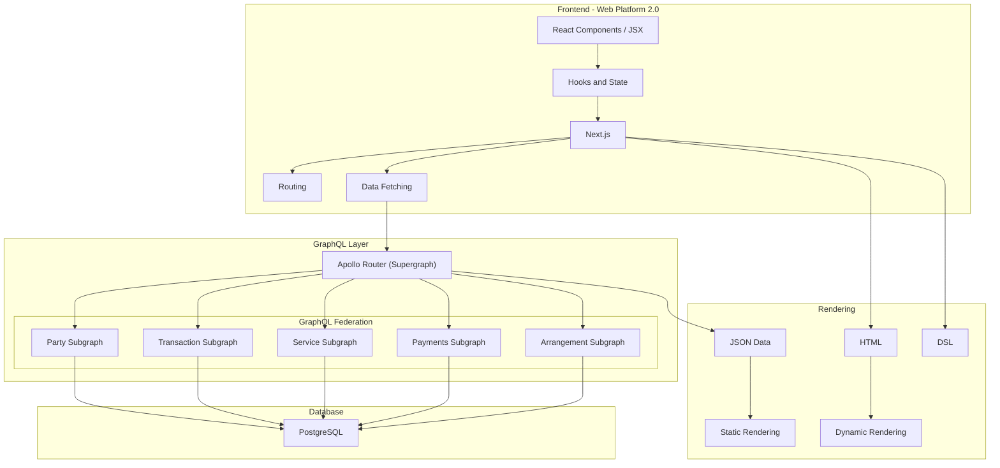

# E-Commerce Platform Architecture Plan

## Overview

This document outlines the architecture for an e-commerce platform built with Next.js, React, GraphQL, and PostgreSQL. The architecture follows a modern web application approach with GraphQL Federation and leverages both static and dynamic rendering capabilities of Next.js.

## System Architecture

## Component Breakdown

### Frontend Layer

- **React Components**: UI building blocks using JSX
- **Hooks and State**: State management using React hooks
- **Next.js**: Framework for server-side rendering and static site generation
- **Routing**: App Router for handling navigation
- **Data Fetching**: Fetching data from GraphQL API

### GraphQL Layer

- **Apollo Router**: Gateway for GraphQL federation
- **GraphQL Federation**: Composed of multiple subgraphs:
  - **Party Subgraph**: User accounts, profiles, roles, permissions
  - **Transaction Subgraph**: Orders, order history, cart management
  - **Service Subgraph**: Product catalog, categories, search
  - **Payments Subgraph**: Payment methods, processing, invoicing
  - **Arrangement Subgraph**: Promotions, discounts, special offers

### Database Layer

- **PostgreSQL**: Relational database for storing all application data

### Rendering Strategies

- **Static Rendering**: Pre-rendered content for product pages, categories
- **Dynamic Rendering**: Real-time content for user-specific data, cart
- **JSON Data**: Data exchange format between frontend and backend
- **HTML**: Markup language for web pages
- **DSL**: Domain-specific language for specialized functionality
