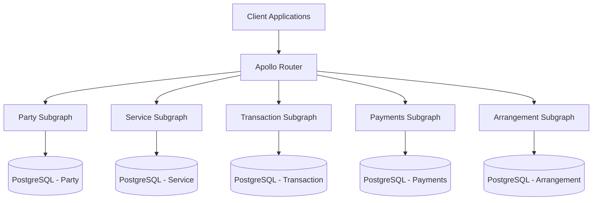

# GraphQL Federation Technical Specification

## Overview

This document provides a detailed technical specification for implementing GraphQL Federation in our e-commerce platform. GraphQL Federation allows us to split our GraphQL schema into multiple subgraphs, each responsible for a specific domain, while presenting a unified API to clients.

## Federation Architecture



## Subgraph Responsibilities

### 1. Party Subgraph

**Domain**: User management, authentication, and authorization

**Key Entities**:
- User
- Role
- Permission
- Address

**Responsibilities**:
- User registration and authentication
- User profile management
- Role-based access control
- Address management

### 2. Service Subgraph

**Domain**: Product catalog and inventory management

**Key Entities**:
- Product
- Category
- Inventory
- Review

**Responsibilities**:
- Product information management
- Category hierarchy
- Inventory tracking
- Product reviews and ratings

### 3. Transaction Subgraph

**Domain**: Orders and shopping cart

**Key Entities**:
- Order
- OrderItem
- Cart
- CartItem

**Responsibilities**:
- Shopping cart management
- Order processing
- Order history
- Order status tracking

### 4. Payments Subgraph

**Domain**: Payment processing and invoicing

**Key Entities**:
- Payment
- PaymentMethod
- Invoice
- Transaction

**Responsibilities**:
- Payment processing
- Payment method management
- Invoice generation
- Transaction history

### 5. Arrangement Subgraph

**Domain**: Promotions, discounts, and special offers

**Key Entities**:
- Promotion
- Discount
- Coupon
- SpecialOffer

**Responsibilities**:
- Promotion management
- Discount calculation
- Coupon validation
- Special offer application

## Federation Implementation

### 1. Entity References

We'll use the `@key` directive to define entity references across subgraphs:

```graphql
# In Party Subgraph
type User @key(fields: "id") {
  id: ID!
  email: String!
  firstName: String
  lastName: String
  # Other user fields
}

# In Transaction Subgraph
type Order @key(fields: "id") {
  id: ID!
  user: User! @provides(fields: "id")
  # Other order fields
}

# Reference to User in Transaction Subgraph
type User @key(fields: "id") @extends {
  id: ID! @external
  orders: [Order!]!
}
```

### 2. Entity Resolution

Each subgraph will implement resolvers for its entities:

```typescript
// In Party Subgraph
const resolvers = {
  User: {
    __resolveReference: async (reference) => {
      const { id } = reference;
      return await userRepository.findById(id);
    }
  }
};

// In Transaction Subgraph
const resolvers = {
  User: {
    orders: async (user) => {
      return await orderRepository.findByUserId(user.id);
    },
    __resolveReference: async (reference) => {
      const { id } = reference;
      // Minimal user object with just the ID
      return { id };
    }
  }
};
```

### 3. Apollo Router Configuration

```yaml
# router.yaml
federation:
  version: 2
supergraph:
  listen: 0.0.0.0:4000
  introspection: true
cors:
  origins:
    - http://localhost:3000
    - https://studio.apollographql.com
headers:
  all:
    request:
      - propagate:
          named: "authorization"
```

## Subgraph Schema Definitions

### 1. Party Subgraph Schema

```graphql
extend schema
  @link(url: "https://specs.apollo.dev/federation/v2.0",
        import: ["@key", "@shareable", "@provides", "@external"])

type User @key(fields: "id") {
  id: ID!
  email: String!
  firstName: String
  lastName: String
  fullName: String
  createdAt: DateTime!
  updatedAt: DateTime!
  addresses: [Address!]!
  roles: [Role!]!
}

type Address {
  id: ID!
  user: User!
  type: AddressType!
  street: String!
  city: String!
  state: String!
  postalCode: String!
  country: String!
  isDefault: Boolean!
}

enum AddressType {
  BILLING
  SHIPPING
}

type Role {
  id: ID!
  name: String!
  permissions: [Permission!]!
}

type Permission {
  id: ID!
  name: String!
  description: String
}

scalar DateTime

type Query {
  me: User
  user(id: ID!): User
  users: [User!]!
}

type Mutation {
  register(input: RegisterInput!): AuthPayload!
  login(input: LoginInput!): AuthPayload!
  updateUser(input: UpdateUserInput!): User!
  addAddress(input: AddAddressInput!): Address!
  updateAddress(id: ID!, input: UpdateAddressInput!): Address!
  deleteAddress(id: ID!): Boolean!
}

input RegisterInput {
  email: String!
  password: String!
  firstName: String!
  lastName: String!
}

input LoginInput {
  email: String!
  password: String!
}

input UpdateUserInput {
  firstName: String
  lastName: String
  email: String
}

input AddAddressInput {
  type: AddressType!
  street: String!
  city: String!
  state: String!
  postalCode: String!
  country: String!
  isDefault: Boolean!
}

input UpdateAddressInput {
  type: AddressType
  street: String
  city: String
  state: String
  postalCode: String
  country: String
  isDefault: Boolean
}

type AuthPayload {
  token: String!
  user: User!
}
```

### 2. Service Subgraph Schema

```graphql
extend schema
  @link(url: "https://specs.apollo.dev/federation/v2.0",
        import: ["@key", "@shareable", "@provides", "@external"])

type Product @key(fields: "id") {
  id: ID!
  name: String!
  description: String
  price: Money!
  images: [Image!]!
  category: Category
  attributes: [ProductAttribute!]!
  inventory: Inventory!
  reviews: [Review!]!
  averageRating: Float
  createdAt: DateTime!
  updatedAt: DateTime!
}

type Money {
  amount: Float!
  currency: String!
}

type Image {
  id: ID!
  url: String!
  altText: String
  isPrimary: Boolean!
}

type Category @key(fields: "id") {
  id: ID!
  name: String!
  description: String
  parent: Category
  children: [Category!]!
  products: [Product!]!
}

type ProductAttribute {
  name: String!
  value: String!
}

type Inventory {
  quantity: Int!
  isInStock: Boolean!
  restockDate: DateTime
}

type Review {
  id: ID!
  product: Product!
  user: User! @provides(fields: "id")
  rating: Int!
  comment: String
  createdAt: DateTime!
}

type User @key(fields: "id") @extends {
  id: ID! @external
  reviews: [Review!]!
}

scalar DateTime

type Query {
  product(id: ID!): Product
  products(
    categoryId: ID
    search: String
    minPrice: Float
    maxPrice: Float
    sort: ProductSortInput
    pagination: PaginationInput
  ): ProductConnection!
  category(id: ID!): Category
  categories(parentId: ID): [Category!]!
}

input ProductSortInput {
  field: ProductSortField!
  direction: SortDirection!
}

enum ProductSortField {
  PRICE
  NAME
  CREATED_AT
  RATING
}

enum SortDirection {
  ASC
  DESC
}

input PaginationInput {
  page: Int!
  pageSize: Int!
}

type ProductConnection {
  edges: [ProductEdge!]!
  pageInfo: PageInfo!
  totalCount: Int!
}

type ProductEdge {
  node: Product!
  cursor: String!
}

type PageInfo {
  hasNextPage: Boolean!
  hasPreviousPage: Boolean!
  startCursor: String
  endCursor: String
}

type Mutation {
  createProduct(input: CreateProductInput!): Product!
  updateProduct(id: ID!, input: UpdateProductInput!): Product!
  deleteProduct(id: ID!): Boolean!
  createCategory(input: CreateCategoryInput!): Category!
  updateCategory(id: ID!, input: UpdateCategoryInput!): Category!
  deleteCategory(id: ID!): Boolean!
  createReview(input: CreateReviewInput!): Review!
  updateInventory(productId: ID!, quantity: Int!): Inventory!
}

input CreateProductInput {
  name: String!
  description: String
  price: MoneyInput!
  categoryId: ID
  attributes: [ProductAttributeInput!]
  inventoryQuantity: Int!
  images: [ImageInput!]
}

input MoneyInput {
  amount: Float!
  currency: String!
}

input ProductAttributeInput {
  name: String!
  value: String!
}

input ImageInput {
  url: String!
  altText: String
  isPrimary: Boolean!
}

input UpdateProductInput {
  name: String
  description: String
  price: MoneyInput
  categoryId: ID
  attributes: [ProductAttributeInput!]
}

input CreateCategoryInput {
  name: String!
  description: String
  parentId: ID
}

input UpdateCategoryInput {
  name: String
  description: String
  parentId: ID
}

input CreateReviewInput {
  productId: ID!
  rating: Int!
  comment: String
}
```

### 3. Transaction Subgraph Schema

```graphql
extend schema
  @link(url: "https://specs.apollo.dev/federation/v2.0",
        import: ["@key", "@shareable", "@provides", "@external"])

type Order @key(fields: "id") {
  id: ID!
  orderNumber: String!
  user: User! @provides(fields: "id")
  items: [OrderItem!]!
  status: OrderStatus!
  subtotal: Money!
  tax: Money!
  shipping: Money!
  total: Money!
  shippingAddress: Address!
  billingAddress: Address!
  payment: Payment
  createdAt: DateTime!
  updatedAt: DateTime!
}

type OrderItem {
  id: ID!
  order: Order!
  product: Product! @provides(fields: "id name price")
  quantity: Int!
  unitPrice: Money!
  subtotal: Money!
}

type Cart @key(fields: "id") {
  id: ID!
  user: User @provides(fields: "id")
  items: [CartItem!]!
  subtotal: Money!
  tax: Money!
  total: Money!
  createdAt: DateTime!
  updatedAt: DateTime!
}

type CartItem {
  id: ID!
  cart: Cart!
  product: Product! @provides(fields: "id name price")
  quantity: Int!
  unitPrice: Money!
  subtotal: Money!
}

enum OrderStatus {
  PENDING
  PROCESSING
  SHIPPED
  DELIVERED
  CANCELLED
  REFUNDED
}

type User @key(fields: "id") @extends {
  id: ID! @external
  orders: [Order!]!
  cart: Cart
}

type Product @key(fields: "id") @extends {
  id: ID! @external
  name: String! @external
  price: Money! @external
}

type Payment @key(fields: "id") {
  id: ID!
}

type Address {
  street: String!
  city: String!
  state: String!
  postalCode: String!
  country: String!
}

type Money {
  amount: Float!
  currency: String!
}

scalar DateTime

type Query {
  order(id: ID!): Order
  orders(userId: ID, status: OrderStatus): [Order!]!
  cart(id: ID!): Cart
  myCart: Cart
}

type Mutation {
  createOrder(input: CreateOrderInput!): Order!
  updateOrderStatus(id: ID!, status: OrderStatus!): Order!
  addToCart(productId: ID!, quantity: Int!): Cart!
  updateCartItem(cartItemId: ID!, quantity: Int!): CartItem!
  removeFromCart(cartItemId: ID!): Cart!
  clearCart: Cart!
}

input CreateOrderInput {
  cartId: ID!
  shippingAddressId: ID!
  billingAddressId: ID!
}
```

### 4. Payments Subgraph Schema

```graphql
extend schema
  @link(url: "https://specs.apollo.dev/federation/v2.0",
        import: ["@key", "@shareable", "@provides", "@external"])

type Payment @key(fields: "id") {
  id: ID!
  order: Order! @provides(fields: "id")
  amount: Money!
  paymentMethod: PaymentMethod!
  status: PaymentStatus!
  transactionId: String
  createdAt: DateTime!
  updatedAt: DateTime!
}

type PaymentMethod @key(fields: "id") {
  id: ID!
  user: User! @provides(fields: "id")
  type: PaymentMethodType!
  provider: String!
  accountNumber: String
  expiryMonth: Int
  expiryYear: Int
  isDefault: Boolean!
  createdAt: DateTime!
  updatedAt: DateTime!
}

enum PaymentMethodType {
  CREDIT_CARD
  DEBIT_CARD
  PAYPAL
  BANK_TRANSFER
}

enum PaymentStatus {
  PENDING
  PROCESSING
  COMPLETED
  FAILED
  REFUNDED
}

type Invoice {
  id: ID!
  order: Order! @provides(fields: "id")
  payment: Payment
  invoiceNumber: String!
  issuedAt: DateTime!
  dueAt: DateTime!
  paidAt: DateTime
  amount: Money!
  status: InvoiceStatus!
}

enum InvoiceStatus {
  ISSUED
  PAID
  OVERDUE
  CANCELLED
}

type User @key(fields: "id") @extends {
  id: ID! @external
  paymentMethods: [PaymentMethod!]!
}

type Order @key(fields: "id") @extends {
  id: ID! @external
  payment: Payment
  invoice: Invoice
}

type Money {
  amount: Float!
  currency: String!
}

scalar DateTime

type Query {
  payment(id: ID!): Payment
  paymentsByOrder(orderId: ID!): [Payment!]!
  paymentMethod(id: ID!): PaymentMethod
  paymentMethods(userId: ID!): [PaymentMethod!]!
  invoice(id: ID!): Invoice
  invoicesByOrder(orderId: ID!): [Invoice!]!
}

type Mutation {
  createPayment(input: CreatePaymentInput!): Payment!
  updatePaymentStatus(id: ID!, status: PaymentStatus!, transactionId: String): Payment!
  refundPayment(id: ID!, amount: Float): Payment!
  addPaymentMethod(input: AddPaymentMethodInput!): PaymentMethod!
  updatePaymentMethod(id: ID!, input: UpdatePaymentMethodInput!): PaymentMethod!
  deletePaymentMethod(id: ID!): Boolean!
  createInvoice(orderId: ID!): Invoice!
  markInvoiceAsPaid(id: ID!, paymentId: ID!): Invoice!
}

input CreatePaymentInput {
  orderId: ID!
  amount: MoneyInput!
  paymentMethodId: ID!
}

input MoneyInput {
  amount: Float!
  currency: String!
}

input AddPaymentMethodInput {
  type: PaymentMethodType!
  provider: String!
  accountNumber: String
  expiryMonth: Int
  expiryYear: Int
  isDefault: Boolean!
}

input UpdatePaymentMethodInput {
  provider: String
  accountNumber: String
  expiryMonth: Int
  expiryYear: Int
  isDefault: Boolean
}
```

### 5. Arrangement Subgraph Schema

```graphql
extend schema
  @link(url: "https://specs.apollo.dev/federation/v2.0",
        import: ["@key", "@shareable", "@provides", "@external"])

type Promotion @key(fields: "id") {
  id: ID!
  name: String!
  description: String
  discountType: DiscountType!
  discountValue: Float!
  startDate: DateTime!
  endDate: DateTime!
  isActive: Boolean!
  applicableProducts: [Product!]
  applicableCategories: [Category!]
  minimumOrderAmount: Money
  maximumDiscount: Money
  usageLimit: Int
  usageCount: Int!
  createdAt: DateTime!
  updatedAt: DateTime!
}

type Coupon @key(fields: "id") {
  id: ID!
  code: String!
  promotion: Promotion!
  isRedeemed: Boolean!
  redeemedBy: User
  redeemedAt: DateTime
  createdAt: DateTime!
  expiresAt: DateTime!
}

enum DiscountType {
  PERCENTAGE
  FIXED_AMOUNT
  FREE_SHIPPING
  BUY_X_GET_Y
}

type Product @key(fields: "id") @extends {
  id: ID! @external
  applicablePromotions: [Promotion!]!
}

type Category @key(fields: "id") @extends {
  id: ID! @external
  applicablePromotions: [Promotion!]!
}

type User @key(fields: "id") @extends {
  id: ID! @external
  redeemedCoupons: [Coupon!]!
}

type Money {
  amount: Float!
  currency: String!
}

scalar DateTime

type Query {
  promotion(id: ID!): Promotion
  promotions(isActive: Boolean): [Promotion!]!
  activePromotions: [Promotion!]!
  coupon(code: String!): Coupon
  validateCoupon(code: String!): CouponValidationResult!
}

type CouponValidationResult {
  isValid: Boolean!
  coupon: Coupon
  errorMessage: String
}

type Mutation {
  createPromotion(input: CreatePromotionInput!): Promotion!
  updatePromotion(id: ID!, input: UpdatePromotionInput!): Promotion!
  deletePromotion(id: ID!): Boolean!
  activatePromotion(id: ID!): Promotion!
  deactivatePromotion(id: ID!): Promotion!
  createCoupon(input: CreateCouponInput!): Coupon!
  redeemCoupon(code: String!): RedeemCouponResult!
}

input CreatePromotionInput {
  name: String!
  description: String
  discountType: DiscountType!
  discountValue: Float!
  startDate: DateTime!
  endDate: DateTime!
  applicableProductIds: [ID!]
  applicableCategoryIds: [ID!]
  minimumOrderAmount: MoneyInput
  maximumDiscount: MoneyInput
  usageLimit: Int
}

input UpdatePromotionInput {
  name: String
  description: String
  discountType: DiscountType
  discountValue: Float
  startDate: DateTime
  endDate: DateTime
  applicableProductIds: [ID!]
  applicableCategoryIds: [ID!]
  minimumOrderAmount: MoneyInput
  maximumDiscount: MoneyInput
  usageLimit: Int
}

input MoneyInput {
  amount: Float!
  currency: String!
}

input CreateCouponInput {
  code: String!
  promotionId: ID!
  expiresAt: DateTime!
}

type RedeemCouponResult {
  success: Boolean!
  coupon: Coupon
  errorMessage: String
}
```

## Subgraph Implementation

Each subgraph will be implemented as a separate Node.js service with the following structure:

```
/packages/subgraphs/[subgraph-name]/
├── src/
│   ├── index.ts                # Entry point
│   ├── schema.ts               # GraphQL schema
│   ├── resolvers/              # GraphQL resolvers
│   │   ├── index.ts
│   │   ├── Query.ts
│   │   ├── Mutation.ts
│   │   └── [Entity].ts
│   ├── domain/                 # Domain models
│   │   └── [Entity].ts
│   ├── repositories/           # Data access
│   │   └── [Entity]Repository.ts
│   └── services/               # Business logic
│       └── [Entity]Service.ts
├── prisma/                     # Prisma ORM
│   └── schema.prisma
└── package.json
```

## Apollo Router Configuration

The Apollo Router will be configured to compose the subgraphs into a supergraph:

```yaml
# supergraph.yaml
federation_version: 2
subgraphs:
  party:
    routing_url: http://party-subgraph:4001/graphql
    schema:
      file: ./subgraphs/party/schema.graphql
  service:
    routing_url: http://service-subgraph:4002/graphql
    schema:
      file: ./subgraphs/service/schema.graphql
  transaction:
    routing_url: http://transaction-subgraph:4003/graphql
    schema:
      file: ./subgraphs/transaction/schema.graphql
  payments:
    routing_url: http://payments-subgraph:4004/graphql
    schema:
      file: ./subgraphs/payments/schema.graphql
  arrangement:
    routing_url: http://arrangement-subgraph:4005/graphql
    schema:
      file: ./subgraphs/arrangement/schema.graphql
```

## Authentication and Authorization

Authentication will be handled by the Party subgraph, which will issue JWT tokens. The Apollo Router will validate these tokens and pass user information to the subgraphs via the `currentUser` context.

```typescript
// In Apollo Router
const router = new ApolloRouter({
  async serverWillStart() {
    return {
      async drainServer() {
        // Cleanup
      },
    };
  },
  async requestDidStart() {
    return {
      async didResolveOperation({ request, context }) {
        const token = request.http?.headers.get('authorization')?.split(' ')[1];
        if (token) {
          try {
            const decoded = jwt.verify(token, process.env.JWT_SECRET);
            context.currentUser = decoded;
          } catch (error) {
            // Invalid token
          }
        }
      },
    };
  },
});
```

## Entity Resolution

Entity resolution will be handled by the `__resolveReference` resolver in each subgraph:

```typescript
// In Party Subgraph
const resolvers = {
  User: {
    __resolveReference: async (reference, { dataSources }) => {
      return await dataSources.userAPI.getUserById(reference.id);
    },
  },
};

// In Service Subgraph
const resolvers = {
  Product: {
    __resolveReference: async (reference, { dataSources }) => {
      return await dataSources.productAPI.getProductById(reference.id);
    },
  },
};
```

## Conclusion

This GraphQL Federation technical specification provides a comprehensive guide for implementing a federated GraphQL API for our e-commerce platform. By following this specification, we'll create a modular, scalable, and maintainable API that can evolve over time as our business needs change.